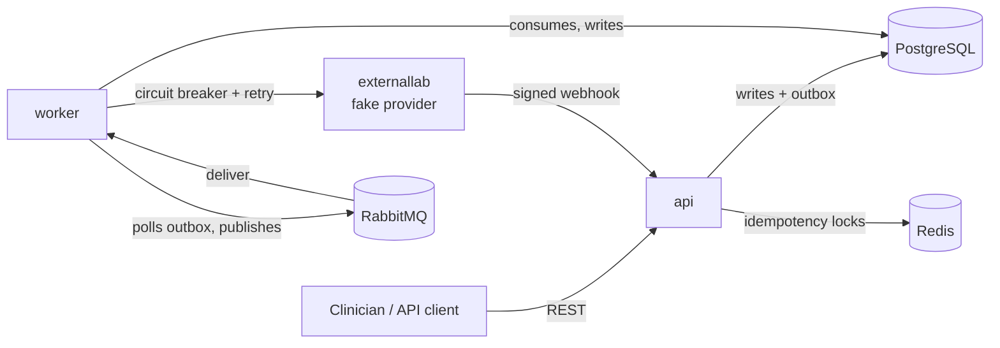
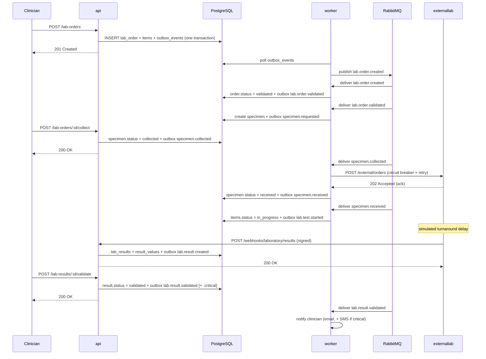

# Architecture

## System overview

Three processes share one codebase and one Postgres database:

- **api** ([cmd/server](cmd/server/index.js)) — the REST API. Talks to
  Postgres and Redis. Never talks to RabbitMQ directly.
- **worker** ([cmd/worker](cmd/worker/index.js)) — every RabbitMQ consumer
  (see EVENTS.md) plus the outbox relay that publishes events on the api's
  behalf. Talks to Postgres, Redis, and RabbitMQ, and makes outbound HTTP
  calls to laboratory providers.
- **externallab** ([cmd/externallab](cmd/externallab/index.js)) — a fake
  third-party laboratory. Only exists so this project has something real to
  integrate with; see "External laboratory integration" below.

Why split api and worker into separate processes instead of one monolith:
the API's job is to accept a request, validate it, commit it, and respond —
fast, and independent of whether RabbitMQ or the external laboratory happen
to be healthy at that moment. Everything that can be slow or flaky (talking
to RabbitMQ, talking to a third party) happens in the worker, off the
request path. This is also why the API's `/ready` check doesn't include
RabbitMQ (see [internal/http/routes/health.js](internal/http/routes/health.js))
— a RabbitMQ outage should degrade the worker, not take the API down.

## The lab order lifecycle

A second diagram, focused on the retry/DLQ mechanics rather than the happy
path, is at [docs/sequence-diagrams/retry-and-dlq.mmd](docs/sequence-diagrams/retry-and-dlq.mmd).

## Why the transactional outbox

The API needs to do two things atomically: write to Postgres, and tell
RabbitMQ about it. Those are two different systems — there's no
transaction that spans both. Publishing to RabbitMQ *inside* the HTTP
request, after the DB commit, has an obvious failure mode: the commit
succeeds, the process crashes (or RabbitMQ is briefly unreachable) before
the publish, and the event is gone forever even though the order exists.

The outbox sidesteps this by making the event part of the same
transaction as the domain write. `outbox_events` (migrations/0015) gets a
row in the exact same `withTransaction` block that creates the order (see
[internal/domain/labOrders/service.js](internal/domain/labOrders/service.js)
and [internal/events/outbox.js](internal/events/outbox.js)). Either both
commit or neither does — there's no window where the order exists but the
fact that it needs an event doesn't. A separate loop in the worker
([internal/events/outboxRelay.js](internal/events/outboxRelay.js)) polls
for pending rows every second and publishes them with RabbitMQ publisher
confirms, marking each row published only after the broker confirms
receipt.

This is deliberately **at-least-once** delivery, not exactly-once: if the
worker crashes after the broker confirms a publish but before the row is
marked `published`, the relay's next tick will publish it again on
restart. See "Idempotency" below for why that's fine.

## Idempotency

Three independent mechanisms, each closing a different gap:

1. **API-level, for client retries.** `POST /lab-orders` accepts an
   `Idempotency-Key` header. A Redis `SET NX` lock arbitrates two
   concurrent requests carrying the same key (one proceeds, the other gets
   `409` and should retry shortly); the durable record in
   `idempotency_keys` means a request replayed hours later still gets the
   original response instead of a second order. See
   [internal/http/middleware/idempotency.js](internal/http/middleware/idempotency.js).
2. **Webhook-delivery-level, for a redelivered webhook.** Every inbound
   results webhook carries a `webhookId`. It's inserted into
   `integration_requests` under a partial unique index on
   `(laboratory_id, external_reference_id)` (migrations/0013); a
   redelivery hits `ON CONFLICT DO NOTHING`, gets no row back, and the
   handler reports `already_processed` without touching `lab_results`
   again. See [internal/http/routes/webhooks.js](internal/http/routes/webhooks.js).
3. **Domain-level, for redelivered *events*.** RabbitMQ is at-least-once:
   if the worker crashes after a handler finishes its writes but before
   the message is acked, the same event is redelivered and the handler
   runs again. Every handler in `internal/workers/` is written to tolerate
   that:
   - `orderValidationWorker` no-ops if the order isn't still `pending`.
   - `specimenRequestWorker` no-ops if a specimen already exists for the
     order.
   - `specimenDispatchWorker` no-ops if the specimen has already moved
     past `collected` (otherwise a redelivery would re-send the order to
     the laboratory and regress the specimen's status).
   - `labResultsService.createResult` relies on the unique constraint on
     `lab_results.lab_order_item_id` and returns the existing result on a
     unique-violation instead of erroring, so even a result that reaches
     it twice by some other path than the webhook dedup can't create a
     duplicate.

   `tests/integration/workerIdempotency.test.js` exercises exactly this —
   calling a handler twice with identical event data and asserting the
   second call is a no-op.

Three layers because each protects against a different actor retrying:
the client, the laboratory, and RabbitMQ's own delivery guarantee. None of
them alone covers all three.

## Retries and circuit breaking

Two independent retry mechanisms at two different layers:

- **The laboratory adapter** ([internal/adapters/laboratory/FakeHttpLaboratoryAdapter.js](internal/adapters/laboratory/FakeHttpLaboratoryAdapter.js))
  wraps its HTTP call in an `opossum` circuit breaker and a short
  retry-with-backoff (3 attempts, ~300ms–4s). This handles a *single*
  request's transient blip — a dropped connection, one slow response —
  without involving RabbitMQ at all. Once the breaker is open (the
  provider is clearly down, not just slow once), further calls fail fast
  instead of piling up.
- **Consumers** ([internal/events/consumerRunner.js](internal/events/consumerRunner.js))
  retry a failed *event* with exponential backoff (1s → 2s → 4s → ... up
  to 60s, capped, with jitter) via the retry-queue-with-TTL pattern
  described in EVENTS.md. This handles failures the adapter's own retry
  didn't absorb — including a sustained laboratory outage.

Put together: a request that fails once retries in milliseconds via the
adapter; a laboratory that's down for an extended period exhausts the
adapter's retries quickly, which fails the event handler, which then
retries on RabbitMQ's slower schedule for as long as that consumer's
`maxRetries` allows before landing in the DLQ. `result-notify-critical`
gets more retries than the others (8 vs. 5) specifically because losing a
critical-result page is worse than losing a routine one.

## Dead-letter queues

See EVENTS.md for the exact mechanics. The short version: once a
consumer's `maxRetries` is exhausted, the message is written to the
`dead_letters` table (queryable — no RabbitMQ management UI required to
see what failed and why) and parked in that consumer's DLQ. Nothing
auto-drains a DLQ; that's intentional; a message there represents
something that needs a human, not a bug to route around silently.

## Structured logging and correlation IDs

Every log line is JSON (`pino`). A correlation ID is assigned per HTTP
request (reused if the caller sent `X-Correlation-Id`, generated
otherwise), threaded through `AsyncLocalStorage`
([internal/logger/context.js](internal/logger/context.js)) so it doesn't
need to be passed as an argument through every function call, and carried
into any event that request's transaction enqueues via the outbox. A
consumer picks it back up from the event envelope and runs its handler
inside a context carrying the same ID. The result: every log line touched
by one order's journey — API request, outbox publish, however many
consumer hops, however many retries — shares one correlation ID, so
`grep`-ing for it reconstructs the whole story.

## Connection pooling, timeouts, graceful shutdown

- Postgres access goes through one `pg.Pool` per process
  ([internal/db/pool.js](internal/db/pool.js)), sized by
  `POSTGRES_POOL_MAX`, with configurable idle and connection timeouts.
- The laboratory adapter's HTTP client has an explicit timeout (4s) so a
  hanging connection can't tie up the worker indefinitely; the circuit
  breaker has its own, separate timeout as a second layer.
- Both `cmd/server` and `cmd/worker` install `SIGTERM`/`SIGINT` handlers
  that stop accepting new work, let in-flight work finish, close the
  RabbitMQ connection and channels, close the Redis client, close the DB
  pool, and *then* exit — with a hard timeout that forces exit if any of
  that hangs, so a stuck shutdown can't block a deploy forever. See the
  bottom of [cmd/server/index.js](cmd/server/index.js) and
  [cmd/worker/index.js](cmd/worker/index.js).

## External laboratory integration and the adapter pattern

`laboratories` is a table, not a hardcoded config value — each row has a
`code`, `adapter_type`, `base_url`, and `webhook_secret`.
[internal/adapters/laboratory/LaboratoryAdapter.js](internal/adapters/laboratory/LaboratoryAdapter.js)
defines the interface (`sendOrder`); `FakeHttpLaboratoryAdapter`
implements it against `cmd/externallab`, and
[internal/adapters/laboratory/index.js](internal/adapters/laboratory/index.js)
is a small factory keyed by `adapter_type`. Adding a second, real provider
means writing one more class implementing `sendOrder` and adding one entry
to that factory — nothing in `specimenDispatchWorker` or anywhere else in
the domain layer changes, since they only ever depend on the interface.

`cmd/externallab` plays the part of that provider realistically enough to
exercise the parts of the integration that matter: it acknowledges an
order asynchronously, delivers results via a *signed webhook* after a
simulated delay (not a synchronous response — the real workflow is
async), occasionally reports a test as failed, and can be told (via an
`X-Simulate-Failure` header on `/external/orders`) to return `500`,
`422`, or hang past the adapter's timeout, for manually exercising the
retry and circuit-breaker paths against a real HTTP round trip.

## Eventual consistency

Order state moves forward asynchronously — creating an order returns
`201` with status `pending` long before it's `validated`, and there's a
real (usually sub-second, but not bounded) window where `GET /lab-orders/:id`
reflects a status the system is still catching up to represent. This is a
deliberate trade: the alternative is doing all of that work — reference
validation, specimen creation, notifications — synchronously inside the
original HTTP request, which makes that request's latency and success
depend on RabbitMQ, the database, and (transitively, once dispatch is
involved) a third-party laboratory all being available *at that instant*.
Decoupling means the client gets a fast, durable "yes, this is recorded"
response, and the rest of the pipeline runs at its own pace, retrying
through whatever's temporarily unavailable instead of failing the whole
request for it.

The cost is that "read your own write" doesn't fully hold across the
whole object graph immediately — `items[].status` and `specimen` on a
freshly-created order will lag the terminal state briefly. Every client in
this repo (the test suite included, see `tests/e2e/labOrderLifecycle.test.js`)
handles that by polling `GET /lab-orders/:id` until the field it cares
about shows up, which is the same thing a real frontend would do (or,
more realistically, subscribe to a notification rather than poll — out of
scope here, but the correlation-ID-tagged audit trail and the event log
make it straightforward to add later).

## Answers to specific failure scenarios

**The laboratory API goes down for 10 minutes.** Each call the adapter
makes fails fast once its circuit breaker opens; `specimenDispatchWorker`'s
handler throws; `consumerRunner` retries with backoff (1s, 2s, 4s, 8s,
16s — over 30s already) up to `maxRetries` (5 for that consumer), then
writes the message to `dead_letters` and parks it in the DLQ. No order is
silently lost or corrupted — it's visibly stuck at `specimen_collected`,
and the `dead_letters` row plus `integration_requests` history says
exactly why. Once the laboratory recovers, replaying the dead-lettered
message (or, in this project's scope, re-triggering the flow) picks up
cleanly since `specimenDispatchWorker` only acts on a specimen still in
`collected` status.

**The same result webhook arrives five times.** The first call inserts
the `integration_requests` row and processes the results; the next four
hit the unique-index conflict, get no row back, and short-circuit to
`{ status: "already_processed" }` without calling `labResultsService`
again. Covered by `tests/webhooks/webhooks.test.js`'s "five redeliveries"
test.

**The worker crashes after processing an event but before acknowledging
it.** RabbitMQ redelivers the message (it never left the queue —
unacked messages go back to the front for redelivery once the consumer's
channel drops). The handler runs again with identical data. Every handler
in the pipeline is written to recognize "this already happened" and no-op
— see "Idempotency" above. Covered by `tests/integration/workerIdempotency.test.js`,
which calls each handler twice in a row and asserts the second call
changes nothing.

## Deliberate scope decisions

- **One specimen per order.** A real order could need multiple specimens
  (different tubes for different tests). This project models one
  specimen per order and, when an order's tests span more than one
  specimen type, logs a warning and defaults to the first test's type
  (`specimenRequestWorker`). Extending to multiple specimens is mostly a
  matter of keying `specimens` and the collect/dispatch flow by
  `(lab_order_id, specimen_type)` instead of `lab_order_id` alone.
- **One result per ordered test.** `lab_results.lab_order_item_id` is
  unique — a test can't be re-run and produce a second result under the
  same order item. A real system would model re-tests as a new order item
  (or a new order) rather than overwriting history.
- **The `users` table isn't in the assignment's table list.** Role-based
  auth needs accounts to attach roles to; `clinicians` models the clinical
  role in the domain (who ordered the test), not a login. `users`
  optionally links to a `clinicians` row via `clinician_id` for a
  clinician who also has an account.
